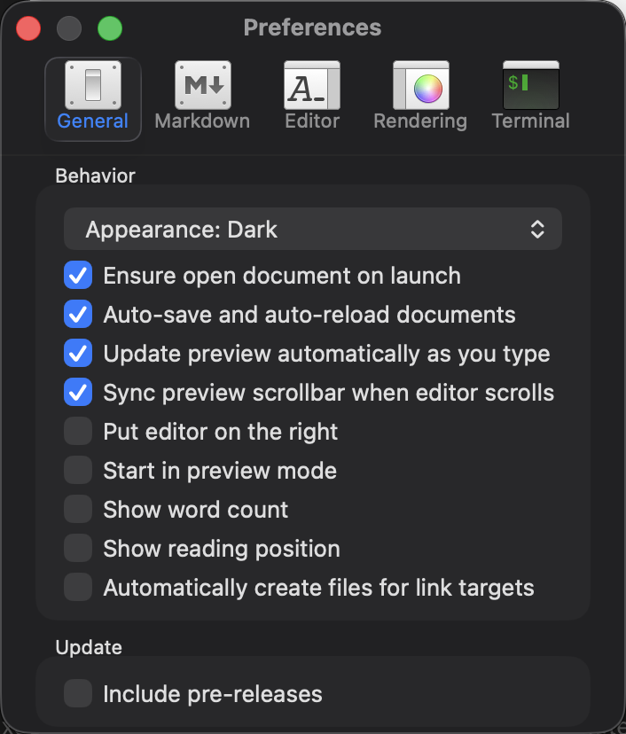

# Fonctionnalités de lecture — livraison et revue du code

Date : 8 octobre 2026. Branche : `codex/reader-features`. Référence de départ : `8164130`.

## Résultat et périmètre

Les six demandes sont prises en charge : retour à la ligne des blocs de code, apparence de l'application, position de lecture, ouverture en mode lecture, thèmes communautaires et callouts Quarto. Le mode lecture global existait déjà : il a été conservé et testé sur plusieurs nouvelles fenêtres, sans créer un second mécanisme.

Cette revue porte sur le code ajouté ou modifié, ses appelants et ses consommateurs : préférences, fenêtres, rendu principal, export HTML/PDF, renderer Quick Look et phases de construction des ressources. Elle ne constitue pas une nouvelle validation intégrale des anciens fichiers du dépôt. Aucun ancien inventaire d'audit n'est recertifié.

Les résultats exécutés, les empreintes des journaux et l'inventaire des fichiers de ce changement sont enregistrés dans `verification.json` et `inventaire.csv`, dans ce dossier. Les journaux complets et résultats XCTest restent dans `build/ReaderFeatures` et `build/AuditCampaign03/Logs/Test`.

## Comportements livrés

| Demande | Comportement | Activation |
| --- | --- | --- |
| Lignes de code longues | Retour visuel à la ligne, y compris un mot de 500 caractères. Le contenu du code reste identique. Même règle partagée par l'aperçu, l'export HTML avec styles et le renderer Quick Look. | Settings → Rendering → **Wrap long code lines** |
| Apparence indépendante | **System**, **Light** ou **Dark**, appliqué aux contrôles AppKit et conservé après relance. Le thème du document reste un choix indépendant. | Settings → General → **Appearance** |
| Pourcentage de lecture | Indicateur indépendant du compteur de mots. 0 % en haut, 100 % en bas ; 100 % quand le document tient dans le panneau. Suit le panneau manipulé, même avec la synchronisation désactivée. | Settings → General → **Show reading position** |
| Mode lecture | Chaque nouvelle fenêtre peut démarrer avec l'éditeur masqué. Le pourcentage reste visible. Réutilisation de la préférence globale existante. | Settings → General → **Start in preview mode** |
| Thèmes communautaires | 37 palettes : 74 variantes d'éditeur, 37 styles d'aperçu et 37 thèmes Prism, soit 148 fichiers de thèmes. Ressources disponibles hors ligne. | Settings → Editor et Rendering ; correspondances dans `docs/themes/community-themes.md` |
| Callouts Quarto | Types `note`, `tip`, `warning`, `important`, `caution`, contenu Markdown, titre fourni par le premier titre Markdown, imbrication et dépliage natif. Rendu partagé par l'application et Quick Look. | Syntaxe Markdown décrite ci-dessous |

Les nouvelles options de retour à la ligne et de pourcentage sont désactivées par défaut. L'apparence suit le système par défaut. Les préférences de thèmes déjà choisies sont conservées.

Capture vérifiée de la fenêtre des réglages en apparence sombre :



### Exemple de callout

```markdown
::: {.callout-note collapse="true"}
## Une information utile

Du texte **important**, une liste ou un bloc de code.

::: {.callout-tip collapse="false"}
## Conseil

Cet encadré commence ouvert.
:::

:::
```

`collapse="true"` commence fermé ; `collapse="false"` commence ouvert. Sans attribut `collapse`, l'encadré est affiché directement. Les délimiteurs incomplets, types inconnus et attributs non pris en charge restent du texte. La syntaxe placée dans du code littéral ne devient pas un encadré.

## Défauts trouvés dans les ajouts et corrigés

Tous les points ci-dessous concernent cette implémentation, pas des régressions attribuées aux anciennes campagnes sans preuve.

| Priorité | Défaut, preuve et impact | Correction et validation |
| --- | --- | --- |
| P2 | Un callout fermé perdait son corps dans le PDF imprimé. Reproduction par impression native et lecture du texte avec PDFKit. | Style d'impression de `::details-content`, sans modifier l'état ouvert/fermé à l'écran. Le test ouvre puis referme le callout, imprime et retrouve son texte. Commit `c745e0a`. |
| P2 | L'analyse des callouts parcourait toutes les plages de code littéral à chaque ligne. Mesure isolée : 2,743583 s pour 20 000 lignes avec du code inline. | Tri des plages puis parcours monotone. Même entrée : 0,020828 s. Contrat supplémentaire avec code indenté, code inline et encadré réel dans le même document. Commit `06b3391`. |
| P2 | Des événements de molette sans début de geste, notamment à la limite d'un panneau, pouvaient laisser le pourcentage attaché à l'autre panneau. Un test d'interface répété a reproduit le problème. | Observation locale des événements de molette, limitée à la fenêtre et aux deux panneaux du document ; événement rendu intact. Suppression de l'observation à la fermeture ou à la désactivation. Test de défilement réel avec synchronisation désactivée. Commit `0492767`. |
| P3 | La mise à jour temporisée pouvait attendre la fin du suivi d'événements. Le mode de run loop par défaut ne garantissait pas une mise à jour pendant le geste. | Temporisation en modes communs, regroupement des mises à jour à 50 ms et annulation à la fermeture. Commit `b7c4a71`. |
| P3 | Le nouveau contrôle de position était reconnu par l'accessibilité mais ne dessinait pas sa case native. Observation sur capture de la fenêtre de réglages. | Alignement de la configuration de cellule sur les cases existantes, notamment `lightByContents`. Vérification visuelle et sélection réelle dans XCTest. Commit `615196c`. |
| P3 | Le thème Hopscotch importait une police depuis Google Fonts. Cette dépendance était incompatible avec une palette intégrée hors ligne. | Suppression de l'import, conservation des polices de repli et traçabilité de cette seule modification dans le manifeste. Vérification de toutes les URL CSS. Commit `29cd57a`. |

Confiance élevée pour les défauts reproduits et les corrections vérifiées sur l'environnement de test. Aucun autre défaut confirmé ne reste ouvert dans le périmètre examiné ; les limites de plateforme figurent ci-dessous.

## Architecture et vérifications du code

Le retour à la ligne utilise une règle CSS commune dans `MPReaderStyles.h`, consommée par les deux renderers. Il ne réécrit pas le Markdown et ne modifie pas les chaînes de code. Le changement de préférence participe à l'invalidation du rendu ; les ressources de l'aperçu prennent en compte la modification du `<head>`.

Les callouts passent par le préprocesseur partagé et le moteur Hoedown existant. Leur contenu ne traverse pas un second parseur Markdown. Des marqueurs propres à chaque analyse évitent les collisions avec le document ; les marqueurs résiduels dans les blocs HTML sont restaurés. Les titres gardent leurs identifiants pour les liens de table des matières. Les positions des cases de tâches restent liées au texte source original.

Le pourcentage utilise uniquement la géométrie du panneau, sans nouvelle analyse Markdown. Il est borné entre 0 et 100 et traite les documents sans hauteur défilable. Les notifications de contenu, de rendu et de taille alimentent le même calcul. Le suivi de panneau est distinct de la synchronisation des deux panneaux. Les observateurs et mises à jour différées sont nettoyés à la fermeture.

L'apparence est appliquée au niveau de `NSApplication`. Les valeurs de préférence invalides reviennent au comportement système. L'observateur de préférences utilise une référence faible et est retiré à la destruction du contrôleur.

Les thèmes sont épinglés au commit `20a444e37182cf75e3f021ac5811ce7ceec59049` de [mfeilen/macdown3000-themes](https://github.com/mfeilen/macdown3000-themes). Le manifeste conserve leurs SHA-256, correspondances, auteurs et licences. L'installateur tiers n'est pas exécuté ni distribué. Les deux phases de ressources ajoutent le même ensemble Prism aux ressources du fournisseur. Les fichiers personnels homonymes continuent de prendre priorité.

## Tests exécutés

Résultats finaux : **1 448 tests natifs et 10 tests UI réussis, sans échec**. Les compilations Debug/Release et les contrôles de ressources réussissent. Les empreintes des preuves sont consignées dans `verification.json`.

| Vérification | Portée |
| --- | --- |
| Suite native MacDown | 1 448 tests ; préférences, rendu, documents, recherche, PDF, Quick Look et autres contrats existants. |
| Suite d'interface | 10 tests ; ouverture, saisie, recherche dans l'aperçu, restauration des documents, mode lecture sur trois fenêtres, réglages conservés après relance et défilement réel des deux panneaux. |
| Callouts | Renderer partagé réellement compilé avec Hoedown : cinq types, Markdown des titres et corps, imbrication, collapse, code littéral, syntaxe non prise en charge, plages littérales mixtes et offsets des tâches. |
| Thèmes | 148 empreintes, 74 analyses avec le vrai parseur PEG, licences, CSS sans ressource distante et deux phases de construction exécutées. Vérification supplémentaire des ressources compilées. |
| Contrats de rendu existants | Accessoires des blocs de code, hiérarchie de table des matières, thème Quick Look et huit combinaisons de thème/numérotation dans WKWebView : tous réussis. |
| Titres longs | 48 styles dans le vrai WebView : six niveaux par style, soit 288 contrôles ; aucune collision de lignes. |
| Wrap | Vrai WebView étroit, activation/désactivation, chaîne de 500 caractères, largeur visible, contenu littéral, export avec/sans styles et préférence réellement lue par Quick Look. |
| PDF | Impression native d'un callout fermé : texte retrouvé avec PDFKit et état du callout préservé après impression. |
| Compilation | Debug et Release universels ; architectures des produits et signature locale contrôlées. |

Les tests UI et natifs sont exécutés en série dans une session isolée. Les préférences et les dossiers de l'utilisateur sont sauvegardés, restaurés et vérifiés par le dispositif de test. Les tests utilisent le bundle Debug, sans remplacer l'application de `/Applications`.

Plusieurs essais intermédiaires ont échoué : attente du layout WebKit trop précoce, lecture incorrecte du type d'une valeur d'accessibilité, clic hors de l'icône d'une case et problème réel de molette décrit plus haut. Deux anciennes fixtures Quick Look utilisaient aussi un objet incomplet à la place des préférences ; elles héritent désormais de leur vrai contrat et fixent explicitement le mode sans wrap pour leur scénario. Ce défaut du banc de test est distinct d'un crash de l'application. Ces essais ne sont pas comptés comme validations ; les résultats finaux correspondent aux corrections et aux parcours exécutés après réparation.

### Reproduire la mesure des callouts

Depuis la racine du dépôt :

```bash
clang -O2 -fobjc-arc -fblocks -framework Foundation \
  -I Pods/Headers/Public \
  docs/audits/reader-features/callout-scan-benchmark.m \
  -o /tmp/macdown-callout-scan-benchmark
/tmp/macdown-callout-scan-benchmark
```

Les temps cités mesurent seulement `MPPrepareCallouts`, sur une entrée synthétique et cette machine. Ils ne représentent pas le temps de rendu complet d'un document réel et ne servent pas de seuil temporel fragile dans la CI.

## Limites et état de livraison

- Tests exécutés sur macOS 26.6.2, Apple Silicon, Xcode 26.2. Les binaires Intel sont compilés mais leur exécution n'a pas été testée sur une machine Intel. Les autres versions de macOS/WebKit ne sont pas certifiées par ces résultats.
- Quarto : prise en charge de ce sous-ensemble de callouts uniquement. Pas d'exécution de notebooks, de moteur Quarto, de références croisées, d'attribut `title`, d'icônes ou de l'ensemble des options Quarto. Voir la [syntaxe officielle des callouts](https://quarto.org/docs/authoring/callouts.html).
- L'impression du contenu des callouts fermés est vérifiée dans le WebKit présent sur cette machine. Le comportement de moteurs anciens sans `::details-content` reste à vérifier.
- L'apparence concerne les fenêtres et contrôles de l'application. La coloration de la barre de menus globale dépend aussi de macOS et n'est pas certifiée séparément. Voir [`NSApplication.appearance`](https://developer.apple.com/documentation/appkit/nsapplication/appearance).
- Le pourcentage est une position dans la hauteur défilable, pas une mesure du texte lu ou du curseur. Les deux panneaux peuvent avoir des hauteurs et ratios différents ; l'indicateur suit le panneau manipulé.
- Le mode lecture est global. Aucun réglage différent par dossier n'a été ajouté.
- Les palettes n'ont pas toutes fait l'objet d'une certification de contraste WCAG. Les trois sélections restent indépendantes ; les correspondances sont documentées.
- Le renderer Quick Look et ses ressources sont testés ; cela ne certifie pas une nouvelle activation de l'extension par Finder dans tous les états de cache du système.
- Les réglages ajoutés sont en anglais dans le XIB de base ; les traductions dédiées restent à fournir.
- La compilation de développement utilise une signature ad hoc locale, sans notarisation ni signature de distribution. Des avertissements existants de dépendances/XCTest sont présents dans les journaux ; une compilation réussie ne signifie pas une compilation sans avertissements.

Chaque fonctionnalité et chaque défaut corrigé a son commit distinct. La liste exacte figure dans `verification.json`. Cette livraison reste sur la branche locale `codex/reader-features` : aucune nouvelle publication GitHub et aucune installation dans `/Applications` n'ont été effectuées pour ces fonctionnalités.
