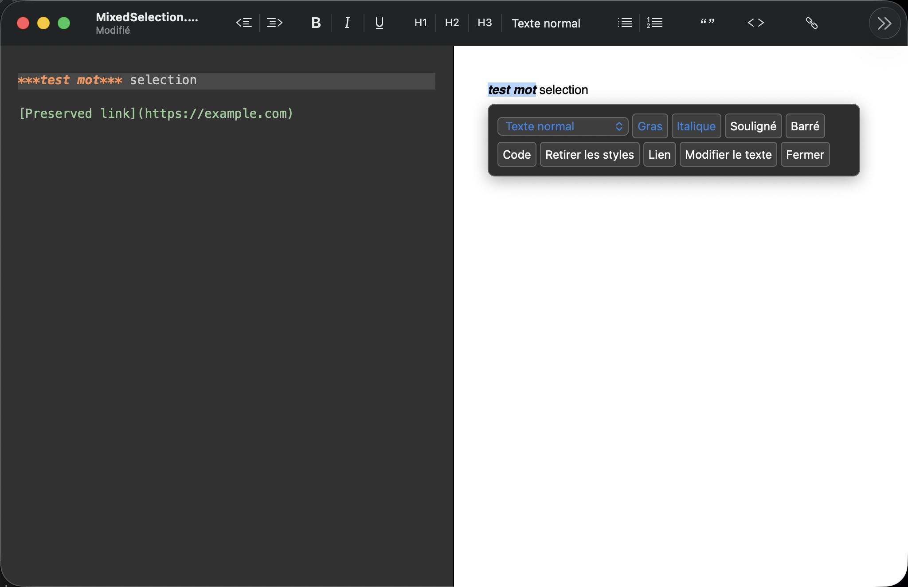

# Édition dans l’aperçu

Le double-clic sélectionne normalement un mot. Pour modifier le texte de droite, sélectionner un passage pris en charge puis choisir « Modifier le texte » dans le panneau. Le passage entier est sélectionné pour être remplacé. Entrée applique la modification, Échap l’annule. Un collage utilise le texte brut et remplace ses retours à la ligne par des espaces. ⌘S applique aussi la saisie en cours avant de sauvegarder ; ⌘Z annule la modification dans le document.

Sélectionner un passage ouvre un panneau flottant après relâchement de la souris. Il reste masqué pendant le déplacement de sélection. Il propose :

- texte normal et titres H1 à H4 ;
- listes à puces, numérotées et de tâches ;
- citation et bloc de code ;
- encadré, menu dépliant et titres dépliants H1 à H4 ;
- gras, italique, souligné, barré, code en ligne et retrait des styles reconnus dans la sélection ;
- lien HTTP, HTTPS ou mailto ;
- équations en ligne et en bloc lorsque MathJax est activé.

Les tâches, blocs de code et équations nécessitent leurs options de rendu respectives. Barré nécessite l’extension correspondante. Les commandes de bloc concernent les lignes source du passage sélectionné, les autres commandes concernent la sélection elle-même. Le soulignement utilise `_texte_` et active l’extension Markdown de soulignement de MacDown. Un lecteur Markdown standard peut afficher ce texte en italique. Les commandes n’insèrent pas de HTML ; les couleurs et surlignages ont été retirés. « Retirer les styles » peut supprimer les anciennes balises de couleur si tout leur contenu est sélectionné. Une sélection partielle de ce contenu est refusée pour préserver les caractères voisins. Les couleurs historiques hors sélection restent intactes. Les wrappers de couleur imbriqués ou dans un lien à réécrire sont refusés lorsque leur conservation ne peut pas être prouvée.

Les espaces au début et à la fin de la sélection restent hors des marqueurs de style. Une mise en forme à l’intérieur d’un mot active l’option existante « Emphasis inside words » : cette préférence de rendu s’applique à tous les documents. Avant une insertion de style en ligne, le moteur vérifie que le Markdown proposé produit réellement le style demandé. Une sélection incompatible est refusée sans écrire de marqueurs visibles dans l’aperçu.

La sélection est rétablie après un changement de titre ou de style compatible, pour enchaîner les réglages sans sélectionner à nouveau le passage. Les clics rapprochés dans le panneau ou sur la barre d’outils attendent le nouveau rendu et suivent leur ordre d’origine. Changer de passage pendant cette attente annule la continuation. La restauration vérifie la nouvelle plage source ; elle ne réutilise pas les nœuds ou le jeton du rendu précédent.

Le panneau reste affiché pendant les changements de mise en forme dont la sélection est rétablie. Il vérifie la sélection avant de se fermer ; désélectionner le texte ferme le panneau, sans bouton « Fermer ». Les boutons correspondant aux styles communs à tous les caractères sélectionnés et le type de bloc commun s’affichent en bleu `#2784DE`. Une sélection peut mélanger du texte normal et du texte déjà mis en forme. Cliquer sur un style non commun l’applique à toute la sélection ; cliquer sur un style commun le retire. Les marqueurs sont déplacés ou fractionnés dans la source, en conservant les autres styles et les caractères extérieurs à la sélection. Pour le code en ligne, les espaces séparant des segments de code ne rendent pas le bouton inactif.

Les boutons de style et de titre de la barre d’outils utilisent la sélection du volet qui a le focus. Dans le visualiseur, une sélection incompatible est refusée sans insérer de marqueurs au curseur de l’éditeur source. Le panneau accepte aussi les sélections dans les titres dont la plage source a été vérifiée.

Le bouton « Texte normal » est également présent à côté de H1, H2 et H3 dans la barre d’outils et utilise la commande de conversion existante.

## Limites de cette version

L’édition visuelle est partielle. Le Markdown reste la source du document. Le moteur vérifie les correspondances avec les nœuds de texte affichés ; il refuse toute correspondance ambiguë. Les sélections traversant plusieurs fragments de mise en forme, ainsi que plusieurs paragraphes ou titres simples, sont prises en charge lorsque toutes leurs correspondances sont prouvées. Les textes répétés sont admissibles si une sonde source identifie exactement leur nœud rendu. Les entités HTML décodées, les transformations typographiques et les structures complexes non vérifiées peuvent nécessiter l’éditeur de gauche.

Les liens existants conservent leur navigation. Leur texte peut être modifié avec « Modifier le texte » après une sélection admissible. La modification directe d’un passage contenant plusieurs lignes source est refusée avec une explication. Le code en ligne permet les commandes de mise en forme ; son remplacement direct reste désactivé. « Modifier le texte » accepte un seul fragment littéral. Les blocs de code, les diagrammes, les formules, les contrôles et les textes générés restent en lecture seule. Au-delà de 2 000 nœuds de texte admissibles, les commandes visuelles sont désactivées pour ce document. Les sondes de texte répété sont limitées à 64 occurrences par texte et 128 sondes supplémentaires par rendu. Les réécritures de style sont limitées à 20 000 unités UTF-16 par paragraphe et 128 lignes non vides pour une sélection de plusieurs blocs ; une ambiguïté ou un dépassement conserve la source et refuse la commande.

Un changement de source ou d’options de rendu peut invalider une saisie en cours. Dans ce cas, elle reste visible et la sauvegarde est refusée : copier son texte, puis Échap permet de revenir au document. Les mises à jour de rendu sont différées tant qu’une saisie visuelle modifiée est présente. Les exports et l’impression appliquent d’abord cette saisie.

Les pages et sous-pages, commentaires, commandes d’IA et colonnes de Notion ne sont pas implémentés. Cette version ne fournit pas un éditeur visuel complet de tous les documents Markdown.

## Architecture

Chaque transaction indique un jeton de rendu, une plage source et une opération autorisée. Le document vérifie le jeton, le contenu source, les bornes UTF-16 et les paramètres avant de passer par la modification native de NSTextView. Les commandes de couleur et de surlignage sont refusées ; les URL exécutables sont refusées ; la saisie brute est échappée pour préserver son sens littéral.

Pour confirmer les plages, une analyse supplémentaire utilise le même pipeline Hoedown et ses options, avec des marqueurs temporaires uniques. Cette analyse ne publie aucun état dans le renderer. Les marqueurs doivent apparaître dans un nœud de texte correspondant ; une occurrence dans une URL, un attribut HTML ou les métadonnées ne suffit pas. Les marqueurs et contrôles d’édition ne sont pas ajoutés aux exports Markdown ou HTML. La réécriture des styles dispose d’une seule implémentation de référence : elle relie les caractères rendus à la source, calcule leurs styles, puis vérifie le rendu de la totalité du document candidat, y compris les liens et les voisins.

Capture historique du 8 octobre : le bouton « Fermer » visible ici a depuis été retiré.

[Rapport de vérification](edition-apercu-verification.md).
